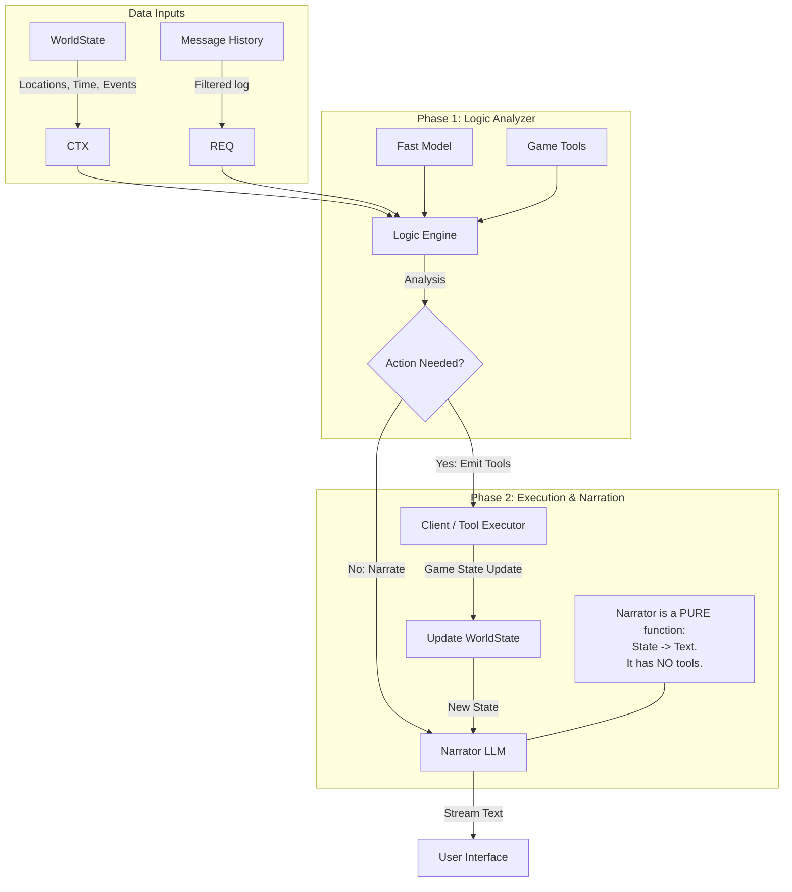
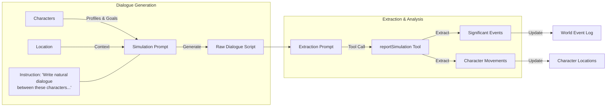

# EmergentJS Prompt Architecture

This document outlines the two primary prompt pipelines used in EmergentJS: the **Main Game Loop (Narrator)** and the **Off-Screen Simulation (World Engine)**.

## 1. System Overview

### Main Chat Loop (Logic-First Architecture)
This pipeline strictly separates **Game Logic (State Changes)** from **Narration (Text Generation)**. This "Pure Architecture" ensures that the Narrator cannot hallucinate game actions and the Logic Engine cannot write dialogue.



### Simulation Loop (World Engine)
This separate "sub-brain" runs when characters are off-screen or when significant time passes.



## 2. Time Tracking Architecture

Time in EmergentJS is dual-layered, tracking both deterministic "ticks" (for simulation logic) and qualitative "Narrative Time" (for storytelling).

### The Dual-Clock System

| Component | Type | Source of Truth | Purpose |
| :--- | :--- | :--- | :--- |
| **Logic Clock** | `integer` (Ticks) | `world.time.tick` | Controls simulation triggers. e.g. "Simulate off-screen NPCs if > 20 ticks passed." |
| **Narrative Clock** | `string` | `world.time.narrativeTime` | Sets the scene for the LLM. e.g. "Late Afternoon", "The dead of night". |

### How Time Advances
Time advances primarily through **Tool Calls** returned by the LLM. The LLM is responsible for updating the "Narrative Time" based on context, while the system assigns fixed "Tick Costs" to actions.

| Action | Tool / Mechanism | Tick Cost | Logic |
| :--- | :--- | :--- | :--- |
| **Movement** | `moveToLocation` | **5** | Defined in `TIME_COSTS.move`. Fixed cost for travel. |
| **Time Skip** | `advanceTime` | **User Defined** | LLM decides cost (e.g. "Wait for 1 hour" -> `ticks: 10`). |
| **Speaking** | Indirect | **1** | Each message exchange implicitly advances time by 1 tick (configurable). |
| **Action** | Indirect | **3** | Generic physical actions cost 3 ticks. |

### Prompt Integration
The prompt receives the current state of both clocks:

> TIME: Late Afternoon (tick 142)

When the LLM calls `moveToLocation`, it *optionally* returns a new `narrativeTime` if significant time has passed:

```json
{
  "tool": "moveToLocation",
  "args": {
    "destination": "The Old Mill",
    "narrativeTime": "Early Evening" // Updates the string clock
  }
}
```

---

## 3. Example: Main Narrator Prompt

**Scenario Context**: The player ("Stranger") is in the "Iron Rose Tavern". It is evening. "Sarah" is present and known. "Gideon" is present but currently undiscovered (hidden).

### The Variables
- **Scenario**: "Shadows of Eldoria - A gritty noir fantasy."
- **Location**: "Iron Rose Tavern - A smoky, dim bar with peeling wallpaper."
- **Time**: "Evening" (Tick: 105)
- **Characters Present**: Sarah (Known), Gideon (Hidden)
- **Recent Events**: "The Mayor was declared missing."

### The Constructed Prompt
*(Source: `app/api/chat/route.ts` - `buildSystemPrompt`)*

```text
You are the narrator and game master of an interactive narrative experience called "Shadows of Eldoria".

SCENARIO: A gritty noir fantasy where magic is illegal and the city is run by crime syndicates.

CURRENT LOCATION: Iron Rose Tavern
OTHER KNOWN LOCATIONS: Town Square, Docks
TIME: Evening (tick 105)

CHARACTERS PRESENT (SYSTEM STATE):
- Sarah: A weary waitress with a sharp tongue.
    Knows: The Mayor was last seen at the docks; The ale is watered down
(NOTE: If a character is participating in the conversation but is NOT listed above, they are not yet discovered. You MUST call discoverCharacter for them immediately.)

HIDDEN (can be discovered if player looks around or circumstances arise): Gideon

RECENT EVENTS:
- The Mayor was declared missing.

YOUR ROLE:
- Narrate the world and characters in response to what the player does
- Play the characters present - give them distinct voices and personalities
- Characters should only know what they have witnessed or been told
- When the player moves to a new location, describe it vividly
- Include sensory details and atmosphere
- Keep responses focused and not overly long
- Characters can suggest actions but never force the player

Tools:
- Use moveToLocation when the player goes somewhere new
- Use advanceTime when significant time passes (long conversations, waiting, etc.)
- Use discoverCharacter when introducing ANY new character (hidden or improvised)

IMPORTANT:
- Stay in character as the narrator
- Never break the fourth wall
- Don't explain game mechanics
- Let the player drive the story
- If you introduce or mention any character (whether from the "HIDDEN" list or a new one you create), you MUST call the discoverCharacter tool for them. Do not just describe them; use the tool to make them official.
- Check the recent history: if a character has been speaking or present but is NOT in the "CHARACTERS PRESENT" list above, call discoverCharacter for them immediately!
- You can call multiply tools in a single turn if needed (e.g. discovering two characters).

EXAMPLES:
User: "I look around and see a mysterious woman named Sarah standing in the shadows."
Assistant: [Calls discoverCharacter({ characterName: "Sarah", introduction: "A mysterious woman standing in the shadows" })]

User: "I walk into the tavern. The bartender, Joe, nods at me. There's also an old sailor named Pete in the corner."
Assistant: [Calls discoverCharacter({ characterName: "Joe", introduction: "The bartender at the tavern" }), Calls discoverCharacter({ characterName: "Pete", introduction: "An old sailor in the corner" })]
```

---

## 4. Example: Off-Screen Simulation Prompt

**Context**: while the player was at the Tavern, "Marcus" and "Lily" were left alone at the "Town Square" for 30 minutes (approx 30 ticks).

### Stage 1: Dialogue Generation
*(Source: `lib/world/simulation.ts` - `runFullSimulation`)*

```text
You are simulating a conversation between Marcus and Lily at Town Square.

Characters:
- Marcus: An ambitious guard captain who suspects corruption.
  Goal: Find evidence against the syndicate.
- Lily: A street urchin who sees everything.
  Goal: Survive the winter and find her brother.

Scenario: A gritty noir fantasy where magic is illegal and the city is run by crime syndicates.
Time: Evening
Available Locations (for movement): Iron Rose Tavern, Docks, City Hall

Write a natural dialogue between these characters. Each character should stay in character.
Format each line as: CHARACTER_NAME: "dialogue"
Include brief action descriptions in *asterisks* when appropriate.
If characters decide to go somewhere else, they should express it in dialogue.

Generate approximately 8 exchanges.
```

### Stage 2: Extraction (The output of this feeds into the prompt used by `reportSimulation` tool)
*(Source: `lib/world/simulation.ts` - `runFullSimulation`)*

**Input (Generated Dialogue from Stage 1):**
> Marcus: "The docks have been quiet. Too quiet." *He paces nervously.*
> Lily: "Maybe that's because they moved the shipment to the old mill tonight."
> Marcus: *Stops pacing.* "The mill? Are you sure?"
> Lily: "I heard Rat-Face talking. I'm going there now to see for myself."
> Marcus: "It's too dangerous. I'm coming with you."

**Extraction Prompt:**
```text
Analyze this conversation and extract significant events and any character movements:

[...Dialogue Text inserted here...]

List any important events (agreements made, information shared, conflicts).
If any character EXPLICITLY decides to leave for another location, report it in movements. Matches must be from: Iron Rose Tavern, Docks, City Hall, Old Mill
```
**Tool Result (JSON):**
```json
{
  "events": [
    {
      "description": "Lily revealed the syndicate shipment is at the old mill.",
      "isSignificant": true
    },
    {
      "description": "Marcus and Lily agreed to investigate the mill together.",
      "isSignificant": true
    }
  ],
  "movements": [
    { "characterName": "Lily", "destination": "Old Mill" },
    { "characterName": "Marcus", "destination": "Old Mill" }
  ]
}
```
